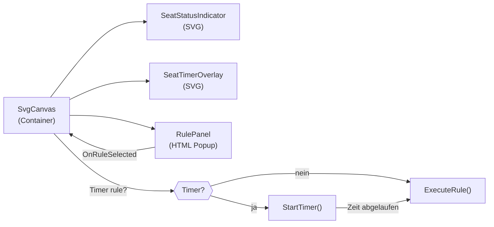

```mermaid
flowchart LR
    A["SvgCanvas\n(Container)"] --> B["SeatStatusIndicator\n(SVG)"]
    A --> C["SeatTimerOverlay\n(SVG)"]
    A --> D["RulePanel\n(HTML Popup)"]
    D -- "OnRuleSelected" --> A
    A -- "Timer rule?" --> E{{"Timer?"}}
    E -- "ja" --> F["StartTimer()"]
    E -- "nein" --> G["ExecuteRule()"]
    F -- "Zeit abgelaufen" --> G
```